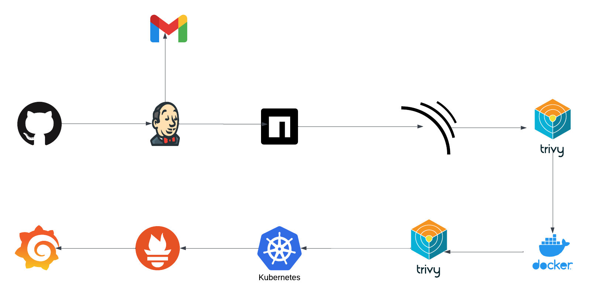

# DevSecOps Project

> project focuses on the secure and scalable deployment of a Netflix application on Kubernetes, integrating DevSecOps best practices. 

## CI/CD Pipeline Diagram

- Developers push code changes to GitHub with a commit message.  
- Jenkins automatically triggers the CI/CD pipeline.  
- Dependencies are installed, the application is built, and tests are executed.  
- SonarQube scans the codebase for vulnerabilities and code quality issues.  
- Trivy scans the Docker image for security threats.  
- Build Docker image and push to DockerHub.  
- Deploying mainfest files to Kubernetes  
- Prometheus and Grafana handle application and infrastructure monitoring.  
- Email notifications 

## Key Features

- Automated CI/CD pipeline for seamless integration and deployment.  
- Comprehensive security scanning for code, dependencies, and container images.  
- Scalable and production-ready Kubernetes deployment.  
- Real-time monitoring and alerting for enhanced reliability.  

